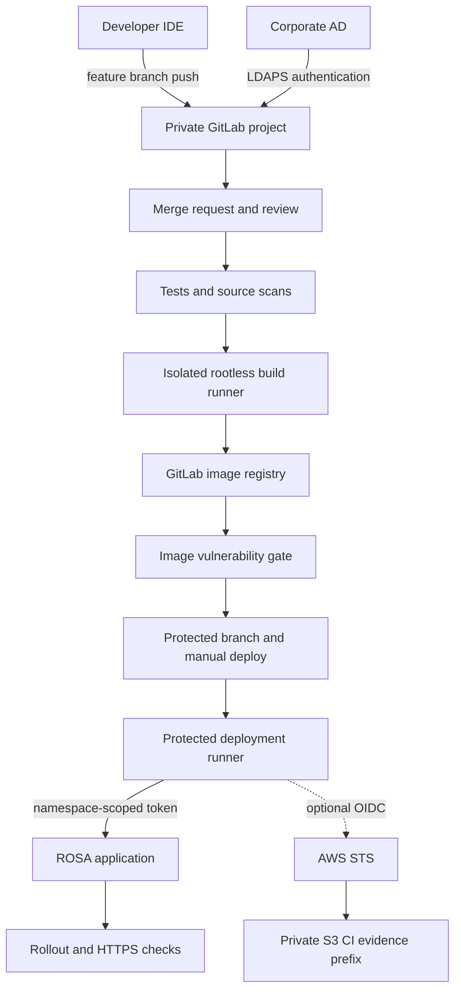
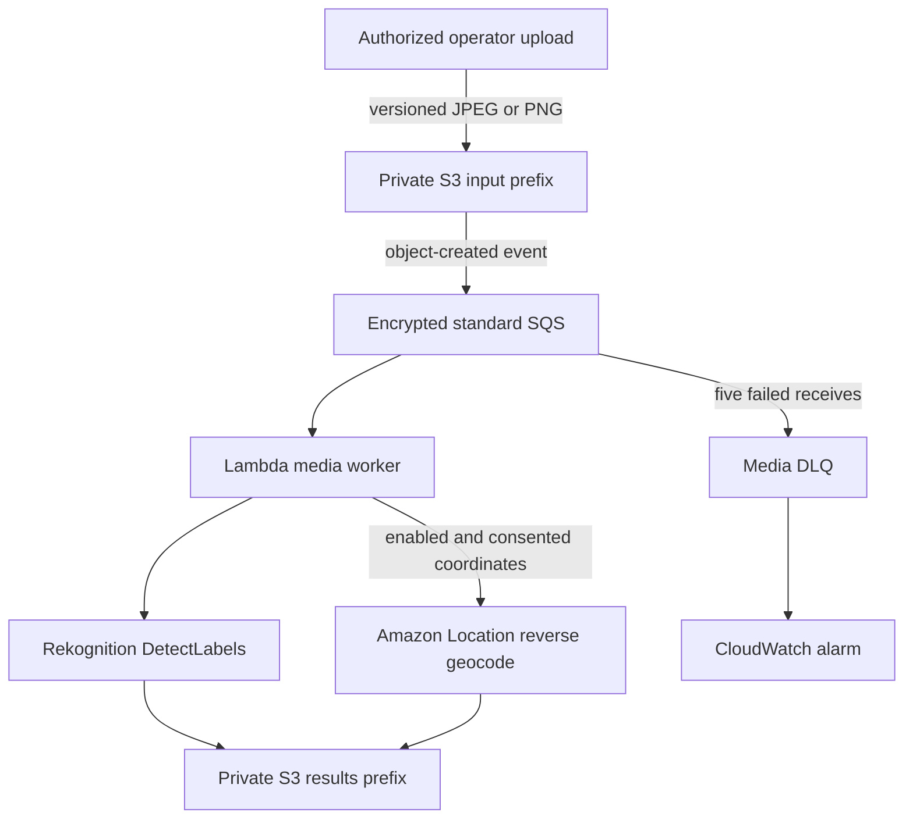
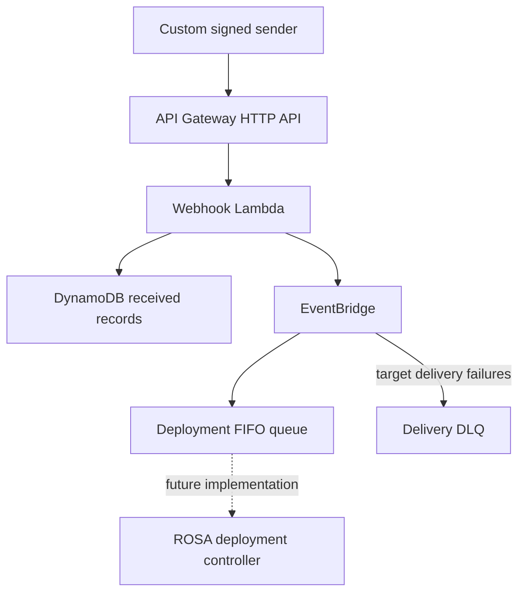

# Project A: developer delivery and optional image intelligence

This proposal builds on PR #1's existing-VPC/NAT changes. Nothing here has been
applied to AWS, ROSA, GitLab or Active Directory. New media services and GitLab AWS
identity are opt-in. The diagram separates working code/templates from remaining
integration work; it is not evidence of a deployed environment.

## 1. Developer delivery and trust boundaries

GitLab is the developer push destination; GitHub holds this review. Import/mirror
this whole repository into GitLab. The root pipeline includes Phase 2 with correct
paths. Start with an existing self-managed GitLab Linux-package installation outside
ROSA; deploying GitLab on ROSA, its persistent storage, databases and upgrades is a
separate deliverable. LDAP settings are for that reference deployment.

CI deploys directly to the named app using restricted Kubernetes RBAC. AWS IAM
cannot grant OpenShift RBAC permissions, and LDAP authentication cannot grant AWS
permissions. Use independent, short-lived machine identities for CI and workloads.
The artifact OIDC role trusts an exact GitLab project/default branch and audience;
it can only PutObject under `ci/`. It is not a Terraform or cluster-admin role.

## 2. Optional image pipeline

Rekognition supplies object/scene labels with confidence scores, not face identity,
malware scanning or a security verdict. No human identification or tracking is
implemented. Geolocation means reverse-geocoding explicitly supplied coordinates;
it does not infer a person's location. Default off at deployment and requires
per-object consent. Only coarse country/locality are retained in results. The raw
upload metadata retains coordinates until lifecycle deletion: make that clear in
any future upload interface. A public upload API, authentication and UI are not
implemented; the sample uses an authorized operator upload.

S3 notifications go to a separate **standard** queue, not the original deployment
FIFO queue. Version IDs prevent overwrites from causing analysis of a different
image. `input/` filtering prevents result writes from recursively triggering work.
Failures report only the affected SQS messages. Duplicate delivery can repeat paid
API calls but writes to the same deterministic result key for the same input version.

## 3. Existing webhook prototype: retained but not the deployment path

Known blockers remain: the receiver expects a custom signature/payload rather than
native GitLab webhooks, and marking DynamoDB RECEIVED before publishing can suppress
a failed publication's retry. The new EventBridge target DLQ only handles failures
AFTER EventBridge accepts an event; it does not repair the Lambda-to-EventBridge
outbox bug. Do not use this prototype as the authoritative deployment trigger until
an outbox/retry design and consumer are implemented. The main GitLab pipeline above
does not depend on it. S3 artifact storage also remains separate from media storage.

## IAM and network boundaries

| Identity | Allowed | Excluded |
|---|---|---|
| Developer | Feature branches, merge requests, authorized GitLab project access | AWS admin and direct protected-branch deployments |
| GitLab artifact OIDC role | Put objects under the one artifact bucket's `ci/` prefix | IAM, Terraform, media reads, artifact deletion |
| GitLab OpenShift deployer | Patch/get/watch named app resources in its namespace | Cluster-admin, Secret access, namespace creation, RBAC edits |
| Webhook Lambda | Existing event-table operations, publish to one bus, own log group | S3 media and Rekognition |
| Media Lambda | Read versioned input prefix, write results prefix, consume one queue, DetectLabels, own logs | Delete/upload inputs, IAM changes, deployment actions |
| Media Lambda with geo enabled | ReverseGeocode against the regional default provider | Tracking, routes, other Places APIs |
| LDAP bind account | Read required users/groups below the chosen base DN | Directory writes and administrative rights |

`DetectLabels` requires Resource `*`; only that action and the configured region are
allowed. ReverseGeocode is scoped to the documented regional provider ARN. CI role
trust is not created unless the existing OIDC provider details are explicitly given.
Never share a namespace with sensitive service accounts when granting Deployment
edit rights. The pipeline credential setup, CA bundles and registry pull credentials
remain operator configuration, not hard-coded files.

## Security controls and deliberately moderate hardening

Implemented Terraform: private S3, bucket-owner enforced ownership, encryption,
TLS-only access, aborting incomplete uploads; explicit SQS encryption, source-scoped
producers, DLQ redrive restrictions; log retention and DLQ alarms; HTTP API throttling.
The media bucket has a separate 30-day current/7-day noncurrent lifecycle. Existing
artifact contents are not assigned automatic expiration by this change.

Implemented app baseline and Ansible patch: non-root, no added capabilities,
no privilege escalation, RuntimeDefault seccomp, no automatic API token, read-only
root with 64 MiB writable `/tmp`. No fixed OpenShift UID, host changes, blanket
package stripping or claim of full CIS/STIG compliance. Keep resource requests,
probes and the existing router-only ingress policy. Egress remains allowed to avoid
silently breaking dependencies; define a tested destination policy before tightening.
Ansible renders a preview by default and requires explicit endpoint/apply variables
to contact a cluster. It targets only the named app, not GitLab/Runner containers.

LDAPS template: port 636, CA verification, group filter, read-only bind account,
password read from a protected file, newly created accounts blocked for approval.
Project/group authorization is assigned separately. AD group synchronization depends
on GitLab tier. See `gitlab/README.md` for private connectivity and activation steps.

## Remaining operational work

| Item | Status / next step |
|---|---|
| NAT routing | Implemented in prerequisite PR #1; apply with original state after plan review |
| GitLab, AD, runners, CA and deploy tokens | Configuration templates/runbook; not provisioned |
| Application pipeline | Implemented; requires a real GitLab runner and namespace bootstrap |
| App security baseline | Tested in CI with read-only filesystem and arbitrary UID; not applied to ROSA |
| Media services | Terraform + worker + tests; disabled by default, not live-tested |
| DLQ notifications | Alarms exist; wire approved notification actions/ownership |
| CloudTrail, GuardDuty, Security Hub, budget alerts | Recommended account-level baseline; not enabled here to avoid duplicate organization services |
| WAF | Design extension: CloudFront/appropriate supported API front door, block origin bypass; no WAF is attached to the HTTP API here |
| Malware quarantine | Future upload-security service; do not treat labels as malware scanning |
| Terraform backend | Existing state remains unchanged; plan encrypted remote state/locking migration separately |
| Webhook outbox and deployment consumer | Still required before enabling event-driven deployments |

## Rollout and verification

1. Merge/apply reviewed NAT changes with the original Terraform state. If a webhook
   log group already exists, import it at
   `module.foundation.aws_cloudwatch_log_group.webhook` before applying this extension.
   Inspect bucket policy/ownership changes and reconcile manually managed policies;
   BucketOwnerEnforced disables ACLs and can affect existing cross-account writers.
2. Keep `enable_media_pipeline=false`, `enable_geolocation=false`, `gitlab_oidc=null`
   initially. Run `terraform init`, `terraform validate`, `terraform test`, then review
   a saved plan. These checks do not apply AWS resources or prove account readiness.
3. Configure GitLab identity, protected runners, namespace bootstrap and scoped RBAC.
   Use the application image, not the old Hello OpenShift config placeholder. Run
   MR checks, inspect a scanned image, approve a dev deployment and verify HTTPS.
4. Preview the Ansible patch; review diffs and compatibility before live application.
5. Opt into media in a reviewed plan. Upload a small consent-free image and verify
   results and queue drain; test a bad image reaching the DLQ. Enable location only
   when the feature and retention have an approved purpose. AWS calls incur charges.
6. Attach alarm notifications, review logs and document cleanup ownership. Never
   destroy the VPC while ROSA depends on it. Media bucket deletion requires explicit
   object/version cleanup because `force_destroy=false`.

## Primary references

- https://docs.gitlab.com/ci/cloud_services/aws/
- https://docs.gitlab.com/ci/docker/using_buildkit/
- https://docs.gitlab.com/administration/auth/ldap/
- https://docs.aws.amazon.com/rekognition/latest/dg/security_iam_service-with-iam.html
- https://docs.aws.amazon.com/service-authorization/latest/reference/list_geo-places.html
- https://docs.aws.amazon.com/location/latest/APIReference/API_geoplaces_ReverseGeocode.html
- https://docs.ansible.com/projects/ansible/latest/collections/kubernetes/core/k8s_module.html
